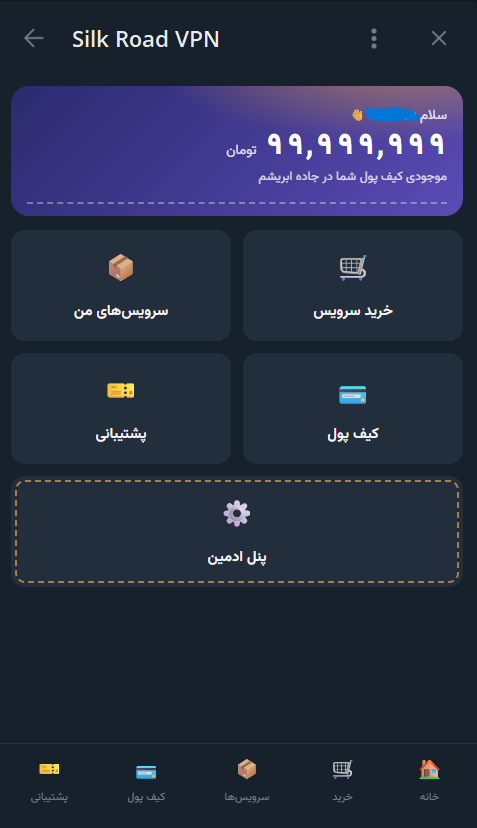
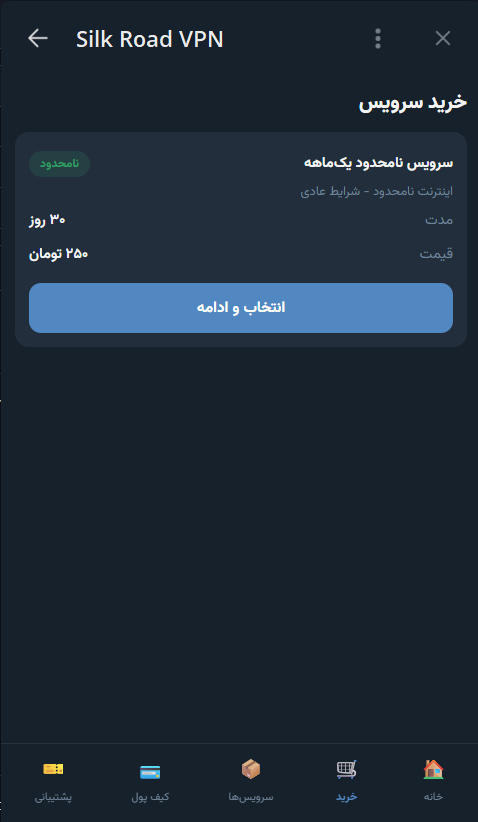
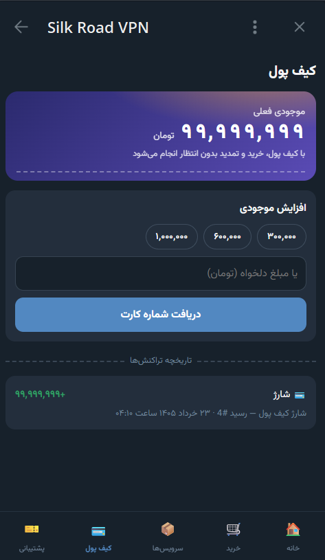
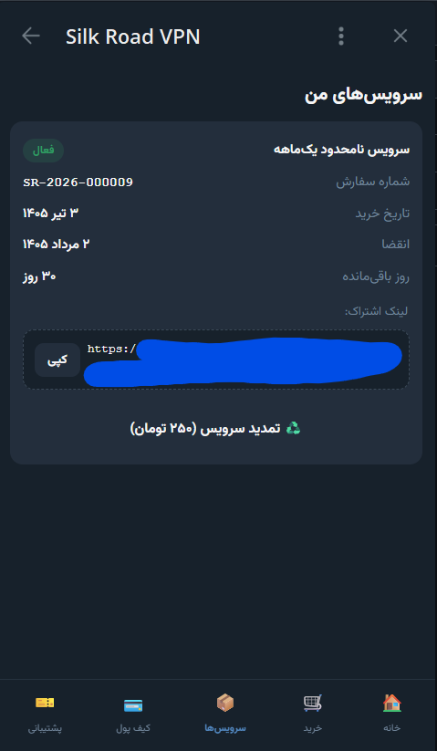
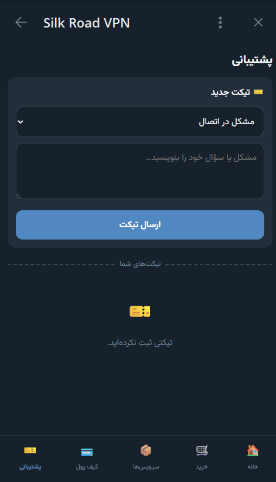
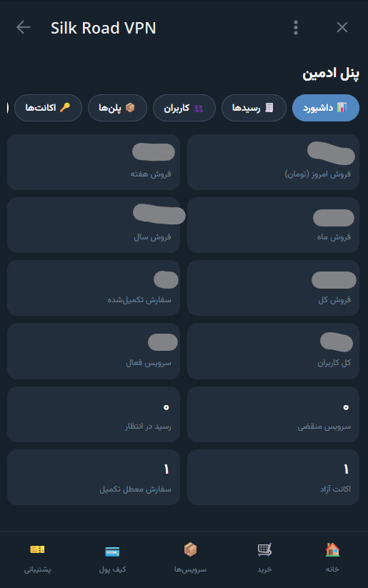

<div align="center">

# 🛣️ Silk Road VPN

### A complete Telegram Mini App for selling VPN subscriptions
**Telegram Bot + Telegram Mini App + Cloudflare Workers + D1 + KV**

[](LICENSE)
[](https://workers.cloudflare.com/)
[](https://core.telegram.org/bots/webapps)

**English** · [فارسی (Persian)](README_FA.md)

</div>

---

## 📖 Project Overview

**Silk Road VPN** is a turn-key, serverless platform for selling VPN
subscriptions directly inside Telegram. Customers browse plans, pay (with an
in-app wallet or card-to-card transfer), and receive their subscription link
**fully automatically** — all without leaving Telegram.

The entire stack runs on **Cloudflare's free tier**:

- A **Telegram Bot** handles `/start`, payment receipts, and admin approvals.
- A **Telegram Mini App** (the storefront + admin panel) is served as static
  assets from the same Worker.
- A **Cloudflare Worker** is the backend (webhook + REST API).
- **Cloudflare D1** (SQLite) is the database.
- **Cloudflare KV** is used for caching and short-lived state.

There is **no build step** and **no framework** — just vanilla JavaScript
(ES modules) and a single Worker. Configuration lives entirely in Cloudflare
secrets, `wrangler.toml`, and a runtime `settings` table, so you can publish
this repository and deploy it **without editing a single line of source code**.

> ⚠️ This is e-commerce software. You are responsible for complying with the
> laws and the Telegram / Cloudflare terms of service that apply to you.

---

## ✨ Features

### Customer side
- 🛍️ **Storefront** — browse active plans with prices and durations.
- 💳 **In-app wallet** — top up via card-to-card and pay instantly.
- ⚡ **Automatic delivery** — wallet purchases deliver the subscription link in seconds.
- 🧾 **Card-to-card** — pay by transfer, send a receipt photo, get auto-activated on approval.
- 📦 **My services** — view active subscriptions, remaining days, and renew.
- ♻️ **Renewals** — extend an existing service with wallet or card.
- 🎫 **Support tickets** — chat with the admin from inside the app.

### Admin side
- 📊 **Dashboard** — sales (today / week / month / year), users, stock, pending items.
- 🧾 **Receipt approval** — approve/reject payments from the panel *or* directly from the bot.
- 👥 **User management** — search, view profiles, adjust wallets, ban, message.
- 📦 **Plan management** — full CRUD for subscription plans.
- 🗂️ **VPN inventory** — add accounts one-by-one or in bulk; auto-assignment on sale.
- 🔧 **Subscription tools** — extend or disable any subscription.
- 📣 **Broadcast** — send a message to all users in safe batches.
- ⚙️ **Settings** — edit card details and channel handle at runtime.

### Engineering
- 🔐 **Telegram `initData` HMAC verification** on every API request — requests can't be forged.
- 🛡️ **Webhook secret** verification on the bot endpoint.
- 🏁 **Race-safe** wallet deductions and VPN account assignment.
- ⏰ **Cron job** that expires overdue subscriptions automatically.
- 🌐 **RTL Persian UI** with light/dark theme that follows Telegram.

---

## 🏗️ Architecture

```
                        ┌─────────────────────────────┐
   Telegram user  ─────▶│        Telegram Cloud        │
        ▲               └──────────────┬──────────────┘
        │                              │  webhook (POST /webhook)
        │  Mini App (WebView)          │  + Mini App opens MINIAPP_URL
        ▼                              ▼
┌───────────────────────────────────────────────────────────────┐
│                    Cloudflare Worker (src/index.js)            │
│                                                               │
│   POST /webhook   → src/bot.js        (bot updates)           │
│   *    /api/*     → src/api.js        (Mini App REST API)     │
│   GET  /health    → health check                              │
│   else            → src/frontend/*    (static Mini App, SPA)  │
│                                                               │
│   scheduled()     → services/subscriptions.js (cron expiry)   │
└───────────────┬───────────────────────────────┬──────────────┘
                │                               │
        ┌───────▼────────┐              ┌───────▼────────┐
        │  Cloudflare D1 │              │  Cloudflare KV │
        │   (SQLite DB)  │              │ cache + state  │
        └────────────────┘              └────────────────┘
```

### Source layout

```
src/
├── index.js              # Worker entrypoint & router (+ cron handler)
├── bot.js                # Telegram webhook: /start, receipts, approvals
├── api.js                # Mini App REST API routes
├── auth.js               # Telegram initData HMAC verification
├── database.js           # D1 helpers: settings, admins, users
├── services/
│   ├── orders.js         # purchase, fulfillment, renewal
│   ├── subscriptions.js  # create/list/extend + cron expiry job
│   ├── vpn.js            # VPN inventory & atomic auto-assignment
│   ├── wallet.js         # balance, history, recharge
│   ├── admin.js          # admin operations (receipts, users, plans, …)
│   └── tickets.js        # support tickets
├── utils/
│   ├── telegram.js       # Telegram Bot API wrapper
│   ├── helpers.js        # JSON responses & security headers
│   └── dates.js          # date helpers
└── frontend/             # the Mini App (served as static assets)
    ├── index.html
    ├── app.js
    ├── api.js
    └── styles.css
```

---

## 📸 Screenshots

> Add your own screenshots to `docs/images/` (see
> [`docs/images/README.md`](docs/images/README.md) for the exact file names).

| Home | Purchase | Wallet |
| :--: | :------: | :----: |
|  |  |  |

| My Services | Support | Admin Panel |
| :---------: | :-----: | :---------: |
|  |  |  |

---

## 🚀 Installation Guide

### Prerequisites

- A [Cloudflare account](https://dash.cloudflare.com/sign-up) (free tier is fine).
- [Node.js](https://nodejs.org/) 18+ and npm.
- The Wrangler CLI: `npm install -g wrangler`
- A Telegram account and a bot created via [@BotFather](https://t.me/BotFather).

### 1. Clone and configure

```bash
git clone https://github.com/4oo4e1/silk-road-vpn.git
cd silk-road-vpn

# Create your real config from the example (this file is git-ignored)
cp wrangler.toml.example wrangler.toml

# Log in to Cloudflare
wrangler login
```

### 2. Create the Cloudflare resources

```bash
# D1 database — copy the printed database_id into wrangler.toml
wrangler d1 create silk-road-db

# KV namespace — copy the printed id into wrangler.toml
wrangler kv namespace create KV
wrangler kv namespace create KV --preview   # copy as preview_id
```

Paste the returned IDs into your `wrangler.toml` (`database_id`, KV `id`,
`preview_id`).

### 3. Apply the database schema

```bash
wrangler d1 execute silk-road-db --remote --file=schema.sql
```

### 4. Set your secrets

```bash
wrangler secret put TELEGRAM_TOKEN            # from @BotFather
wrangler secret put TELEGRAM_WEBHOOK_SECRET   # any random string you invent
```

### 5. Deploy

```bash
wrangler deploy
```

Wrangler prints your Worker URL (e.g.
`https://silk-road-vpn.YOUR_SUBDOMAIN.workers.dev`). Put it in `wrangler.toml`
as `MINIAPP_URL` and run `wrangler deploy` once more so the bot button opens
the right URL.

### 6. Register the Telegram webhook

Replace the placeholders and run (in a terminal or browser):

```bash
curl "https://api.telegram.org/bot<TELEGRAM_TOKEN>/setWebhook?url=https://<YOUR_WORKER_URL>/webhook&secret_token=<TELEGRAM_WEBHOOK_SECRET>"
```

### 7. Make yourself an admin

Get your numeric Telegram ID from [@userinfobot](https://t.me/userinfobot),
then set it in the `settings` table:

```bash
wrangler d1 execute silk-road-db --remote \
  --command "UPDATE settings SET value='[\"YOUR_ADMIN_TELEGRAM_ID\"]' WHERE key='admin_ids';"
```

Open your bot, press **Start**, tap the shop button — you should now see the
**Admin Panel** button too. 🎉

---

## ⚙️ Configuration Guide

This project intentionally does **not** use a `.env` file (Cloudflare Workers
don't read one). Configuration lives in three places:

1. **Secrets** — `wrangler secret put` (encrypted, never in the repo).
2. **`wrangler.toml`** — plain vars + resource IDs (git-ignored; use the
   provided `wrangler.toml.example` as a template).
3. **The `settings` table** — runtime-editable from the admin panel.

### Full configuration reference

| Key | Type | Where it lives | Description |
| --- | ---- | -------------- | ----------- |
| `TELEGRAM_TOKEN` | Secret | `wrangler secret put` | Bot token from @BotFather. Used to call the Bot API and to verify Mini App `initData`. |
| `TELEGRAM_WEBHOOK_SECRET` | Secret | `wrangler secret put` | A random string you choose. Sent to Telegram with `setWebhook` and checked on every webhook call. |
| `MINIAPP_URL` | Var | `wrangler.toml` → `[vars]` | Public HTTPS URL of your Worker/Mini App. The URL the bot button opens. |
| `ASSETS` | Binding | `wrangler.toml` → `[assets]` | Serves the `src/frontend` Mini App as static files (SPA). |
| `DB` | Binding | `wrangler.toml` → `[[d1_databases]]` | The D1 database. Needs `database_name` + `database_id`. |
| `KV` | Binding | `wrangler.toml` → `[[kv_namespaces]]` | KV namespace for caching + state. Needs `id` + `preview_id`. |
| `crons` | Trigger | `wrangler.toml` → `[triggers]` | Schedule for the subscription-expiry job (default hourly). |
| `card_number` | Setting | `settings` table | Card number shown to customers for card-to-card payment. Editable in the admin panel. |
| `card_owner` | Setting | `settings` table | Card holder name shown next to the card number. Editable in the admin panel. |
| `channel_id` | Setting | `settings` table | Your public Telegram channel handle (e.g. `@YourChannel`). |
| `admin_ids` | Setting | `settings` table | JSON array of Telegram numeric IDs allowed into the admin panel. |

> ✅ **No source edits required.** Everything above is configured through
> secrets, `wrangler.toml`, or the `settings` table.

---

## ☁️ Cloudflare Worker Setup

The Worker is defined entirely by `wrangler.toml` (copied from
`wrangler.toml.example`). Key blocks:

- **`[assets]`** serves `src/frontend` as a single-page app, while
  `run_worker_first` keeps `/webhook`, `/api/*`, and `/health` handled by the
  Worker code.
- **`[[d1_databases]]`** binds your D1 database as `env.DB`.
- **`[[kv_namespaces]]`** binds your KV namespace as `env.KV`.
- **`[triggers].crons`** runs `runScheduledJobs()` to expire subscriptions.

Useful commands:

```bash
wrangler dev          # run locally
wrangler deploy       # deploy to Cloudflare
wrangler tail         # live logs from the deployed Worker
```

---

## 🤖 Telegram Bot Setup

1. Talk to [@BotFather](https://t.me/BotFather) → `/newbot` → choose a name and username.
2. Copy the **bot token** and set it as the `TELEGRAM_TOKEN` secret.
3. Configure the **Mini App menu button** so the bot opens your storefront:
   - `/mybots` → select your bot → **Bot Settings** → **Menu Button** →
     **Configure Menu Button** → send your `MINIAPP_URL`.
   - (Optional) `/setdescription`, `/setabouttext`, and `/setuserpic` to brand the bot.
4. Register the webhook (see Installation step 6).

To verify the webhook is set:

```bash
curl "https://api.telegram.org/bot<TELEGRAM_TOKEN>/getWebhookInfo"
```

---

## 🗄️ Database Setup

The schema is in [`schema.sql`](schema.sql). Apply it with:

```bash
wrangler d1 execute YOUR_DB_NAME --remote --file=schema.sql
```

It creates the tables (`users`, `plans`, `vpn_accounts`, `orders`,
`subscriptions`, `wallet_transactions`, `payment_receipts`, `tickets`,
`ticket_messages`, `settings`), indexes, a sample plan, and **placeholder**
settings rows. Replace the placeholder settings with your own values (via the
admin panel or SQL) — see the Configuration Guide.

Adding VPN stock: use the admin panel **VPN** tab (single add or bulk import).
Bulk format is 4 lines per account: `email`, `password`, `subscription_url`,
`dashboard_url`.

---

## 🎨 Bot Customization Guide

Make this bot **yours** without touching the backend logic. There are three
places to customize branding:

### 1. App title (Mini App)

The storefront title is **"جاده ابریشم"** (Silk Road). Change it in
[`src/frontend/index.html`](src/frontend/index.html):

```html
<title>جاده ابریشم</title>   <!-- ← change to your brand name -->
```

There is also a branded line in
[`src/frontend/app.js`](src/frontend/app.js) (wallet subtitle):

```js
<div class="sub">موجودی کیف پول شما در جاده ابریشم</div>   // ← change "جاده ابریشم"
```

### 2. Bot welcome message

The `/start` welcome text lives in the `sendWelcome()` function in
[`src/bot.js`](src/bot.js):

```js
const text =
  `سلام ${name} 👋\n\n` +
  `به <b>جاده ابریشم</b> خوش آمدید.\n\n` +   // ← change the bot name here
  `از طریق دکمه زیر می‌توانید:\n` +
  ...
```

Edit this text (and the button label `🛍 ورود به فروشگاه` in `mainKeyboard()`)
to match your brand, language, or tone.

### 3. Bot identity & Mini App menu button (@BotFather)

- **Bot name / picture / description** — set via @BotFather (`/setname`,
  `/setuserpic`, `/setdescription`, `/setabouttext`).
- **Mini App menu button** — `/mybots` → your bot → **Bot Settings** →
  **Menu Button** → send your `MINIAPP_URL`. This is what makes the blue
  storefront button appear in the chat.

> 💡 The customer-facing payment info (card number, card owner, channel) is
> **not** code — edit it live from the admin panel **Settings** tab.

---

## 🛠️ Admin Panel Explanation

The admin panel is the same Mini App opened with `#admin`. Only Telegram IDs in
`settings.admin_ids` can access it (enforced server-side on every request).

| Tab | What it does |
| --- | ------------ |
| **Dashboard** | Sales totals, user count, active/expired services, pending receipts, VPN stock. |
| **Receipts** | Review pending card-to-card receipts; approve to auto-fulfill, or reject. |
| **Users** | Search users, view full profiles, adjust wallet, ban/unban, send a direct message. |
| **Plans** | Create / edit / (soft) delete subscription plans. |
| **VPN** | Add accounts (single or bulk), update, enable/disable, delete free stock. |
| **Tickets** | Read and reply to support tickets; close resolved ones. |
| **Broadcast** | Send a message to every (non-banned) user in safe batches. |
| **Settings** | Edit card number, card owner, and channel handle at runtime. |

Receipts can **also** be approved/rejected directly from the bot chat via the
inline ✅/❌ buttons attached to each forwarded receipt photo.

---

## 👤 Customer Panel Explanation

The customer storefront has five tabs (bottom navigation):

| Tab | What the customer does |
| --- | ---------------------- |
| 🏠 **Home** | Overview + quick links to the main actions. |
| 🛒 **Buy** | Pick a plan, accept the terms, and pay (wallet or card). |
| 📦 **Services** | See active subscriptions, remaining days, and the subscription link; renew. |
| 💳 **Wallet** | View balance & history; top up via card-to-card. |
| 🎫 **Support** | Open a ticket and chat with the admin. |

**Payment flows:**
- **Wallet** → instant: balance is deducted, a VPN account is auto-assigned,
  and the subscription link is delivered by the bot in seconds.
- **Card-to-card** → the app shows your card details; the customer transfers
  and sends a **receipt photo** to the bot. After admin approval the service is
  activated and delivered automatically.

---

## 🧯 Troubleshooting

| Symptom | Likely cause & fix |
| ------- | ------------------ |
| Mini App shows "authentication failed" | Open the app **from inside Telegram** (the menu button), not a browser. `initData` only exists inside Telegram. |
| Bot doesn't respond to `/start` | Webhook not set or wrong URL. Re-run `setWebhook` and check `getWebhookInfo`. |
| Webhook returns 401 | `TELEGRAM_WEBHOOK_SECRET` mismatch. Set the secret and re-register the webhook with the same `secret_token`. |
| No **Admin Panel** button | Your numeric Telegram ID isn't in `settings.admin_ids`. Update it (see Installation step 7). |
| "ASSETS binding missing" error | The `[assets]` block is missing/wrong in `wrangler.toml`. Copy it from `wrangler.toml.example`. |
| Purchase fails: "capacity full" | No `available` VPN accounts in stock. Add accounts from the admin **VPN** tab. |
| Subscriptions never expire | The cron trigger isn't configured. Add `[triggers].crons` to `wrangler.toml` and redeploy. |
| Receipts arrive but no service is delivered | Out of stock at approval time. Add accounts, then press **Fulfill** on the paid order. |

Use `wrangler tail` to watch live logs while reproducing an issue.

---

## ❓ FAQ

**Does this cost money to run?**
It fits comfortably in Cloudflare's free tier for small/medium volumes (Workers,
D1, and KV all have generous free limits).

**Does it provision VPN accounts automatically?**
No — it **sells and delivers** accounts you add to inventory. You supply the
VPN accounts (email / password / subscription URL / dashboard URL); the app
handles selling, assigning, and delivering them automatically.

**Can I change the language to English?**
Yes. The UI strings are inline in `src/frontend/app.js`, `src/bot.js`, and the
service files. Translate them in place; `dir="rtl"` in `index.html` can be
switched to `ltr`.

**Is there a `.env` file?**
No. See the Configuration Guide — config lives in secrets, `wrangler.toml`,
and the `settings` table.

**Can I have multiple admins?**
Yes. `admin_ids` is a JSON array — add as many numeric IDs as you like.

**How are payments verified?**
Card-to-card payments are **manually** verified by an admin from the receipt
photo. There is no automatic payment gateway integration.

---

## 🔒 Security Notes

- **Secrets never live in the repo.** `TELEGRAM_TOKEN` and
  `TELEGRAM_WEBHOOK_SECRET` are Cloudflare secrets; `wrangler.toml` is
  git-ignored.
- **Every API request is authenticated** by verifying Telegram's `initData`
  HMAC signature (and its freshness) server-side — requests cannot be forged.
- **The webhook is protected** by `X-Telegram-Bot-Api-Secret-Token`
  verification.
- **Admin checks are server-side** on every admin route — the client `#admin`
  hash is only a UI hint.
- **VPN secrets stay admin-only.** Customer-facing code only ever exposes
  `subscription_url`; `worker_email`, `dashboard_password`, and `dashboard_url`
  are never sent to customers.
- **Money operations are race-safe** (guarded `UPDATE` statements for wallet
  deductions and account assignment).
- Before committing, always check your diff for accidental secrets. The
  provided `.gitignore` covers `wrangler.toml`, `.dev.vars`, `.wrangler/`,
  `node_modules/`, and `*.log`.

---

## 📄 License

Released under the [MIT License](LICENSE).

Copyright (c) 2026 4oo4e1.

---

## 💜 Support The Project

If this project saved you time, consider supporting its development. Donations
are **completely optional** and go toward maintenance and new features.

| Coin | Address |
| ---- | ------- |
| **Bitcoin (BTC)** | `bc1qywv4fa5rh576rl7am2a2784tyvg3fe559vx0nw` |
| **Ethereum (ETH)** | `0x4111f0218c8Fd847621F6D89cC5865E6ae3Daf03` |
| **Solana (SOL)** | `GPR6RchFF17bGbkyJuYbM7YkF5i3R9Rp4AdSKj1zgYPS` |
| **BNB Chain (BNB)** | `0x4111f0218c8Fd847621F6D89cC5865E6ae3Daf03` |
| **Polygon (MATIC)** | `0x4111f0218c8Fd847621F6D89cC5865E6ae3Daf03` |
| **USDT (ERC20)** | `0x4111f0218c8Fd847621F6D89cC5865E6ae3Daf03` |

Thank you for your support! 🙏

<div align="center">

⭐ If you find this project useful, please give it a star!

</div>
